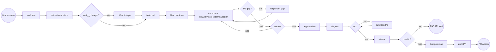
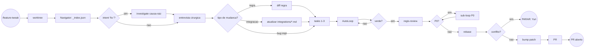
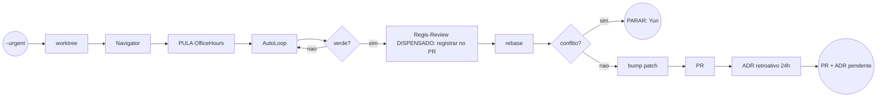
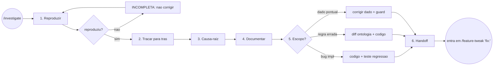

# Pipeline de Desenvolvimento — Guia Prático (Onboarding)

> **Para que serve este guia:** material de onboarding **e** referência rápida para revisitar sempre que
> bater dúvida sobre *como uma mudança de código nasce, é validada e vira PR* — e **qual skill (comando)
> usar em cada situação**, com exemplos práticos do domínio financeiro (Permutas, SISPAG, Popula GED).
>
> Os **diagramas BPMN 2.0 com raias (swimlanes)** desta pasta mostram o fluxo e os handoffs entre agentes.
> Cada `.bpmn` corresponde a **um caminho de entrada** do pipeline. Abaixo, além do BPMN, há uma versão
> **Mermaid** (renderiza direto no GitHub) e um bloco **"quando usar"** com exemplos.
>
> **Fonte normativa:** `CLAUDE.md` (raiz) → seção *Development Pipeline* e os comandos em `.claude/commands/*.md`.
> Se este guia divergir do `CLAUDE.md`, o `CLAUDE.md` vence.

---

## 1. Conceito-chave: Skill (comando) × Agente (raia)

O pipeline tem **dois tipos de peça**, ambos definidos em `.claude/`:

| No diagrama | O que é no Claude Code | Onde mora | Como você usa |
|---|---|---|---|
| O **evento de início** (`/feature-new`, `/feature-tweak`, `/investigate`…) | **Skill / slash command** | `.claude/commands/*.md` | **Você digita** no prompt: `/feature-new "<intenção>"` |
| Cada **raia / ator** (OfficeHoursInterviewer, OntologyCurator, TaskScoper, AutoLoopRunner, PatternGuardian, `qa-*`…) | **Subagente** | `.claude/agents/*.md` | **Você não digita** — o comando os orquestra automaticamente |

> **Resumo:** você dispara **a skill**; os **agentes** rodam sozinhos dentro dela. Você só **age nas pausas**
> (aprovar um diff, confirmar tasks, responder uma pergunta, resolver um conflito de rebase).

---

## 2. Como usar as skills (mecânica)

1. **Digite o comando** com `/` no prompt do Claude Code, passando a intenção em linguagem natural:
   ```
   /feature-new "reconciliar permuta 1:1 entre PROFORMA e INVOICE na baixa da fin010"
   ```
2. **Responda às pausas** conforme o agente pedir (entrevista, aprovação de diff, confirmação de tasks).
3. **Deixe os gates rodarem** (typecheck, lint, test, PatternGuardian, Regis-Review) — só **P0 (crítico)** volta para o loop.
4. O pipeline termina **abrindo o PR**.

### Antes de começar, tenha em mãos (vale para todas as skills)
1. **Intenção de negócio em 1–2 frases** (o *quê*, não a solução técnica).
2. **Um exemplo concreto** (nº de processo, título, lote, NC/ND — com dados sensíveis ocultos).
3. **O consumidor**: API, job em lote, evento? Qual filial/tenant?
4. **Invariantes que NÃO podem quebrar** (se você souber).

### Onde o loop **pausa e espera por você** (human-in-the-loop)
| Pausa | O que fazer |
|---|---|
| Entrevista (OfficeHours) | Responder as perguntas do agente |
| Diff de ontologia (OntologyCurator) | Aprovar / editar / rejeitar **antes** de qualquer código |
| `tasks.md` (TaskScoper) | Confirmar escopo, riscos e arquivos |
| Pergunta P0 (InfoGapBroker) | Editar `ontology/_inbox/<slug>-gap.md` para destravar |
| Conflito de rebase não-trivial | O pipe **para e chama você** — você resolve |
| `--high-risk` | Fazer `/pair-review` antes do PR |

### ⚠️ Nota de ambiente (worktree)
O **Step 0** de `/feature-new` e `/feature-tweak` cria um **git worktree dedicado** (regra inviolável #10).
Os comandos foram escritos para **Windows** (`C:/tmp/<slug>-wt`, caminho curto por causa do limite MAX_PATH).
Em **Linux/macOS**, use um caminho curto equivalente, ex.: `/tmp/<slug>-wt`.

---

## 3. Como ler um BPMN com raias

Cada arquivo é um **pool** (o processo inteiro) dividido em **raias horizontais (swimlanes)** — uma por ator.
**A ação fica dentro da raia de quem a executa**; o fluxo corre da esquerda → direita e as setas **cruzam as
raias** nos handoffs (ex.: o `Dev` dispara, a raia do `OfficeHoursInterviewer` conduz a entrevista, e a seta
sobe de volta para o `Dev` revisar).

| Símbolo | Significado |
|---------|-------------|
| ○ círculo fino | **Início** do processo |
| ◎ círculo grosso (vermelho) | **Fim** do processo / parada |
| ▭ retângulo arredondado | **Tarefa** (ação de um ator) |
| ◇ losango | **Gateway** — decisão (segue 1 saída) |
| → seta cruzando raia | **Handoff** entre atores |

### Como abrir os arquivos `.bpmn`
Os arquivos são **BPMN 2.0 padrão**. Eles **não renderizam no GitHub** (BPMN não é imagem) — abra em:
- **[demo.bpmn.io](https://demo.bpmn.io)** → ☰ → *Open BPMN diagram* (ou arraste o arquivo).
- **Camunda Modeler** (desktop) → *File → Open*.
- **draw.io / diagrams.net** → *Arquivo → Importar*.

> Os diagramas são largos (fluxo horizontal); use *zoom-to-fit* ao abrir. **As versões Mermaid abaixo
> renderizam direto no GitHub** — use-as para consulta rápida; abra o `.bpmn` quando quiser ver as raias.

### Atores (raias) — o que cada um faz
| Ator / raia | Papel no pipe |
|-------------|---------------|
| **Dev / Yuri (Humano)** | Dispara o comando, cria o worktree, revisa/aprova diffs, responde gaps, resolve conflitos de rebase, faz bump+PR |
| `CodebaseNavigator` | Localiza entidade/regra e arquivos via `ontology/_index.json` |
| `OfficeHoursInterviewer` | Entrevista socrática (profunda no `new`, cirúrgica no `tweak`) |
| `OntologyCurator` | Propõe diff em `ontology/`, atualiza `integrations/*.md`, ADRs |
| `TaskScoper` | Spec → `tasks.md` com acceptance criteria |
| `AutoLoopRunner` | Loop TDD → impl → typecheck → lint → test → PatternGuardian → verde; sub-loop P0 |
| `Regis-Review` (8× `qa-*` + consolidador) | Review de arquitetura pós-verde; só **P0** re-entra no loop |

---

## 4. Os 4 caminhos (um diagrama por skill)

| # | Arquivo | Comando | Quando usar |
|---|---------|---------|-------------|
| 1 | [`01-feature-new.bpmn`](01-feature-new.bpmn) | `/feature-new <intent>` | Nova entidade / novo fluxo |
| 2 | [`02-feature-tweak.bpmn`](02-feature-tweak.bpmn) | `/feature-tweak <entity> "<intent>"` | Mudar regra, corrigir bug, alterar entidade |
| 3 | [`03-feature-tweak-urgent.bpmn`](03-feature-tweak-urgent.bpmn) | `/feature-tweak --urgent <entity> "<intent>"` | Hotfix de produção |
| 4 | [`04-investigate.bpmn`](04-investigate.bpmn) | `/investigate <symptom>` | Causa-raiz **antes** de corrigir |

> O caminho 4 (`/investigate`) normalmente **alimenta** o caminho 2: um bug que começa com `"fix: ..."`
> dispara a investigação **antes** de qualquer correção.

---

### Caminho 1 — `/feature-new` · criar algo **novo**

**Para que serve:** o caminho mais completo, para quando **nasce uma entidade ou um fluxo de domínio novo**.
É o único com **entrevista profunda nos 4 eixos** (Entity, Action, Invariant, Integration). Como o domínio
deste repo ainda está **vazio**, é por aqui que você **começa** a modelar cada frente.

**Raias:** Dev · OfficeHoursInterviewer · OntologyCurator · TaskScoper · AutoLoopRunner · Regis-Review.

**Fluxo:**
1. Cria o worktree dedicado.
2. **OfficeHours** → entrevista profunda (você responde).
3. **Você** confirma o flag `entity_changed?`.
4. Se mudou entidade → **OntologyCurator** propõe diff em `ontology/` (você aprova).
5. **TaskScoper** gera `tasks.md` (você confirma).
6. **AutoLoopRunner** → TDD → impl → typecheck → lint → test → PatternGuardian → **verde** (pausa em pergunta P0 se houver).
7. **Regis-Review** → triagem; só **P0** volta ao loop (sub-loop não dispara novo Regis-Review).
8. Rebase → bump de versão (FE+BE) → **PR**.



**Quando usar — exemplos práticos:**
- `/feature-new "modelar a entidade Permuta e a ação reconciliar 1:1 PROFORMA×INVOICE na fin010"`
- `/feature-new "montar o lote diário do SISPAG a partir dos títulos aprovados para baixa no com298"`
- `/feature-new "detectar PDF de NC/ND no SharePoint e casar com a nota pelo número do arquivo"`

**Flags úteis:** `--high-risk` (exige `/pair-review` antes do PR) · `--shotgun` (2–3 direções de UI) ·
`--no-regis-review` · `--base <branch>`.

---

### Caminho 2 — `/feature-tweak` · **ajustar** algo que já existe

**Para que serve:** o caminho do dia a dia para mexer no que **já foi modelado**. Acrescenta a raia do
**CodebaseNavigator** e usa **entrevista cirúrgica** (só o delta: atual vs. desejado).

**Raias:** Dev · CodebaseNavigator · OfficeHoursInterviewer · OntologyCurator · TaskScoper · AutoLoopRunner · Regis-Review.

**Fluxo:**
1. Worktree → **CodebaseNavigator** localiza entidade/regra + arquivos via `_index.json`.
2. Se o intent começa com `fix:` → dispara **`/investigate`** (caminho 4) **antes** da entrevista.
3. **OfficeHours** → entrevista cirúrgica → **bifurcação**:
   - **bug de implementação** → direto ao TaskScoper (sem diff).
   - **mudança de regra** → OntologyCurator faz o diff (você aprova).
   - **mudança de schema de integração** → OntologyCurator **atualiza `integrations/*.md` (obrigatório)**.
4. **TaskScoper** (1–3 tasks) → **AutoLoop** → **Regis-Review** → rebase → bump (`fix`→patch) → **PR**.



**Quando usar — exemplos práticos:**
- `/feature-tweak entities/permuta "adicionar a propriedade idadePendencia"`
- `/feature-tweak business-rules/permuta-match-1-1 "fix: query usava OR em vez de AND"`
- `/feature-tweak integrations/nexxera "mudança no leiaute do arquivo de remessa"`

**Flags úteis:** `--urgent` · `--high-risk` · `--no-regis-review` · `--base <branch>`.

---

### Caminho 3 — `/feature-tweak --urgent` · **hotfix de produção**

**Para que serve:** o caminho **encurtado** para emergência. Mostra explicitamente **o que é pulado** para
ganhar velocidade — e a **dívida** que isso gera.

**Raias:** Dev · CodebaseNavigator · AutoLoopRunner.

**O que muda vs. o tweak normal:**
- **Pula o OfficeHoursInterviewer** (sem entrevista).
- **AutoLoopRunner vai direto** (TDD/impl/gates).
- **Regis-Review DISPENSADO** — mas **registre no PR** que foi dispensado e por quê.
- **ADR retroativo obrigatório em até 24h** em `ontology/decisions/`.
- Worktree continua **obrigatório** (isola o hotfix de outros WIP).



**Quando usar — exemplos práticos:**
- `/feature-tweak --urgent integrations/nexxera "fix: cabeçalho da remessa quebrou e travou o envio do lote de hoje"`
- `/feature-tweak --urgent business-rules/sispag-corte "fix: lote do dia não fechou antes do horário de corte do banco"`

---

### Caminho 4 — `/investigate` · **causa-raiz antes de corrigir**

**Para que serve:** protocolo disciplinado de **diagnóstico** que **não corrige nada** — ele entende o bug e
faz **handoff** para o `/feature-tweak "fix: ..."`. Regra de ouro: **nunca corrija o que você não reproduz**.

**Raias:** Dev/Investigador · CodebaseNavigator.

**Protocolo (6 passos):**
1. **Reproduzir** (id de título/permuta/lote/NC, tenant, timestamp, log exato).
2. **Traçar para trás** (handler → service → repository → input).
3. **Causa-raiz**, categorizando: `data | query | business-logic | config | ontology`.
4. **Documentar** findings (reproducer, fix, risco, teste de regressão).
5. **Confirmar escopo** (bug de código? regra errada na ontologia? dado pontual?).
6. **Handoff** → entra no caminho 2 (`/feature-tweak "fix: ..."`).



**Quando usar — exemplos práticos:**
- `/investigate "permuta 1:1 não disparou na fin010 para o processo 1153"`
- `/investigate "lote SISPAG falhou ao gerar a remessa no diretório Nexxera"`
- `/investigate "PDF da NC 12345 não casou e caiu na fila de exceções do GED"`

---

## 5. Qual skill usar quando (decisão rápida)

| Situação | Skill | Modo de entrevista |
|---|---|---|
| Entidade ou fluxo **novo** | `/feature-new <intent>` | Profunda (4 eixos) |
| **Ajustar** regra existente / alterar entidade | `/feature-tweak <entity> "<intent>"` | Cirúrgica (delta) |
| **Bug** sem causa conhecida | `/investigate <symptom>` | Causa-raiz primeiro, depois tweak |
| **Hotfix** urgente de produção | `/feature-tweak --urgent <entity> "<intent>"` | Pula entrevista; ADR retroativo em 24h |

> **Por onde começar neste repo:** o domínio ainda está **vazio**, então `/feature-tweak` e `/investigate`
> só fazem sentido depois que existir entidade modelada. O ponto de partida natural é **`/feature-new`**.

---

## 6. Invariantes do pipe (valem em todos os caminhos)

1. **Worktree-first** — `/feature-new` e `/feature-tweak` rodam em git worktree dedicado, nunca no checkout principal (regra #10).
2. **Regis-Review obrigatório** após o verde — só **P0 (crítico)** é remediado no loop; P1/P2/P3 viram follow-ups no inbox. Opt-out só com `--no-regis-review` / `--urgent`.
3. **Rebase da base antes do PR** — conflito não-trivial **pausa para o Yuri** (regra #12).
4. **Bump de versão** (FE+BE lockstep) se o delta tem `feat`/`fix`/`perf` → `chore(release): vX.Y.Z`.

---

## 7. Simplificações deliberadas (descritas, mas fora do desenho)

Os diagramas focam o caminho principal. Ficam **descritos aqui**, mas **fora do desenho**:

- **`--shotgun` / DesignConsultant** (2-3 direções criativas para telas de UI) — sub-path opcional do `/feature-new`, antes do TaskScoper.
- **Gate QaCoach / `--high-risk` `/pair-review`** — human-in-the-loop opcional antes do PR quando a feature adiciona handler/job/UI novos.
- **InfoGapBroker no `/feature-tweak`** — pode pausar o AutoLoopRunner numa pergunta P0 (igual ao `/feature-new`).
- **`p0loop` (sub-loop P0)** — aparece como **uma** tarefa na raia do AutoLoopRunner; na prática é um mini-ciclo OfficeHours → Ontology (se a regra mudar) → TaskScoper → AutoLoop, no mesmo worktree, que **não** dispara novo Regis-Review (anti-recursão).

---

## 8. Outras skills do repo (não desenhadas)

Referência rápida — também são comandos em `.claude/commands/`:

| Skill | Para que serve |
|---|---|
| `/regis-review` | Revisão de arquitetura 8-QA (Bass & Clements). Alias: `/arch-review`. |
| `/retro-ontology` | Saúde semanal da ontologia (entidades obsoletas, gaps abertos, drift de cobertura). |
| `/stop-loop <slug>` | Pausa o AutoLoopRunner salvando estado para retomar depois. |
| `/bootstrap-ontology` | (Re)gera a estrutura de `ontology/` a partir do seed `03_ontologia.md`. |
| `/new-tenant`, `/configure-client` | Onboarding e configuração de cliente/tenant. |
| `/check-tenant-health`, `/diagnose-tenant` | Operação multi-tenant. |
| `/explain-workflow` | Explica um workflow. |

---

## 9. Referências

- **`CLAUDE.md`** (raiz) — fonte normativa do pipeline, regras invioláveis e critérios de "verde".
- **`.claude/commands/*.md`** — definição de cada skill (comando).
- **`.claude/agents/*.md`** — definição de cada agente (raia).
- **`ontology/`** — fonte de verdade do domínio (entidades, ações, regras, integrações).
- Os 4 arquivos `.bpmn` desta pasta — diagramas completos com raias (abrir em [demo.bpmn.io](https://demo.bpmn.io)).
